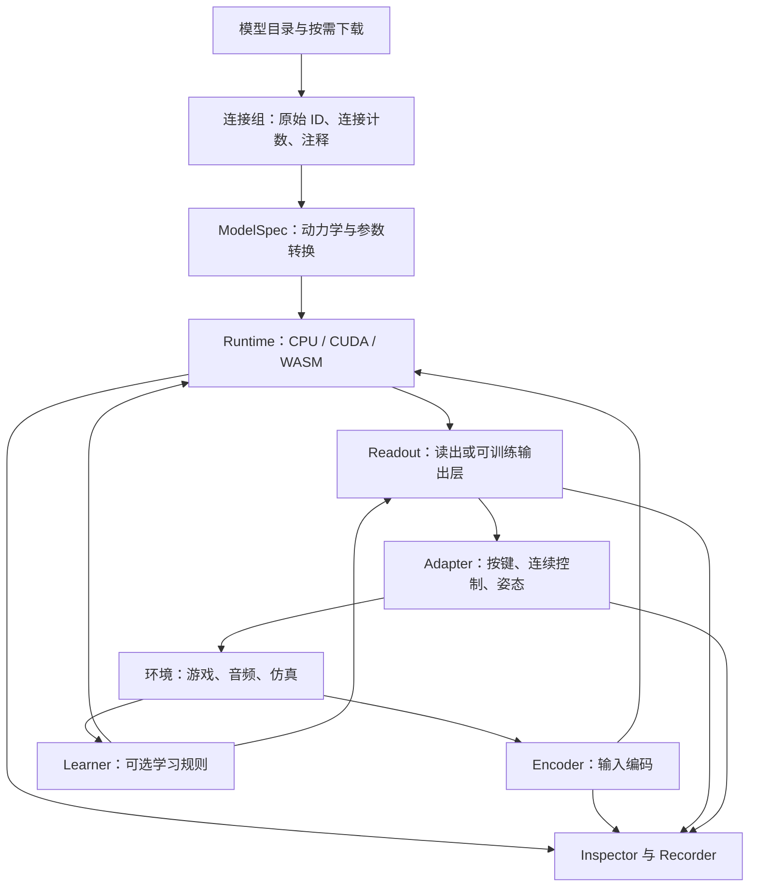

# RFC 0001：开放的连接组运行时与可修改的 Demo Kit

状态：设计提案，部分切片已实现；研究日期：2026-09-10。

本文保留研究时的方案和接口草案，使用方式以当前 API 文档为准。`v0.2.0a1` 已实现真实子回路和开放 Python 接口；`v0.3.0a1` 增加 JS CPU 实验室、可编辑 HTML demo 和 Python 回放。通用环境会话、音频、学习和 CUDA 仍待实现；继续开发的 goal 仍在进行。

## 1. 产品判断

flybrain-sdk 应让开发者快速完成一条可检查的链路：

**选择连接组 → 配置神经模型 → 接入输入 → 运行 → 读取活动 → 接入应用。**

用户第一次接触产品，应当能运行一个完整 demo，再修改它；研究者则能一直拆到原始神经元、连接和数值规则。两者使用相同的运行内核。

建议产品由三部分组成：

1. **SDK**：加载、运行、刺激、观察、干预、保存恢复的稳定接口。
2. **模型和配方目录**：按需下载的连接组、参数、输入输出映射及其来源。
3. **Demo Kit**：可运行、可修改的应用模板，自带调试面板和回放。

官网把这些部分连起来：体验一个 demo → 复制命令 → 获得完整项目 → 修改输入或输出 → 提交自己的模板。

不以增加固定的 `smell()`、`jump()` 方法来衡量通用性。更有效的标准是：开发者能否在不改 SDK 内核的情况下，把同一个脑接到音乐、游戏、可视化或实验上。

## 2. 推特上的玩法与源码核查

本次从 X 作者、公开帖子索引和对应项目追查实现。这是有目的的样本调查，不代表整个社区的占比。X 有些页面无法直接读取，镜像转述只用作线索；有源代码的结论优先依据固定提交，没有代码的项目不推测其训练细节。没有执行第三方项目，也没有复现作者的性能或学习结果。

| 玩法与来源 | 当前能核实的内容 | 对 SDK 的启发 |
|---|---|---|
| Beat Saber，`@_lyraaaa_` | 找到原帖；作者的公开回复镜像称运动输出先拟合回放，视觉反应仍在训练。此次未找到可核查的训练代码 | 把回放、模仿训练、实时闭环和新关卡评估分开；动作不能只支持走路和跳跃 |
| Mario 64，`@barrelshifter` / `ornata/fly` | 仓库直接关联原帖。技术说明包含视角采样、神经输出到摇杆/按键、跨进程桥接及逐 tick 回放 | 提供时间同步、按键事件、连续控制、动作接收确认和回放协议 |
| Doom，`nftechie/doomfly` | 代码将特定群体的放电率映射到转向、前进和攻击；强化输入与可塑性规则是独立模块 | 输出解码、奖励输入和学习规则需要分别替换，不能把奖励脉冲等同于学会任务 |
| Minecraft，`@evnsnclr` / NeuroCraft | 作者公开项目页明确描述神经读出调节脚本身体程序；当次查看时完整软件尚未发布 | 允许“脑选动作、动画执行”的合法使用方式，并显示各部分来源 |
| Minecraft，`blendi-remade/fly-brain-minecraft` | 这是另一项目，不能冒充上面的作者实现。代码有手写寻食、避障、探索兜底，HUD 标记何时接管 | 增加可关闭的控制器组合机制，记录神经输出与兜底后的最终动作 |
| 语音情绪，`@nrol_ling` / Oruk | 作者技术文章使用固定连接组回路与可训练输出层，连续状态动力学；另有音频特征直达输出的分支。原连接与打乱连接的结果没有显示优势 | 神经动力学与设备后端必须分离；支持固定脑训练读出；显式展示绕过脑的支路及消融 |
| 四种音调 → YMCA 姿势，`@dhruvbhatia0` | 作者帖子镜像描述微调后响应四种音调，并称准备开源。此次未定位可核查训练代码 | 音频到连续姿态值得作为模板方向，但不能声称已复现该项目 |
| 桌面宠物，`DenisSergeevitch/desktop-fly` | 项目提供神经读出、关节力矩、身体接触反馈；评估文档也指出部分模式仍由规则/动画实现 | 身体和环境适配器应独立，展示刷新率不能决定神经时间；保存需覆盖整个会话 |
| 音乐可视化，`pentasir/fly-brain-on-music` | 音频特征包括能量、节奏、频段等；代码人为分配频段到细胞组 | 预制音频编码器很有用，但“频段映射”须能编辑、标注假设；无需强制动作输出 |
| 无人机，`dylankainth/flybrain` | 作者文档区分真实连接组脚本与纯规则 demo，描述摄像头、控制命令和机体稳定控制 | 可复用输入/输出适配模式；近期先支持仿真，不把硬件控制作为首个 demo |

这批项目重复做的事情可以归纳为：数据整理、输入编码、群体选择、动力学、输出校准、环境时钟、调试显示、回放，以及部分项目中的训练。真正值得公共化的是这些工作之间的接口和可复用实现。

### 证据链接

- Beat Saber：[原帖](https://x.com/_lyraaaa_/status/2097527368919470162)、[作者回复镜像](https://www.sotwe.com/_lyraaaa_?lang=en)。镜像中的实现说明尚无源码交叉验证。
- Mario：[原帖](https://x.com/barrelshifter/status/2097004115826200898)、[固定版本技术说明](https://github.com/ornata/fly/blob/f2f4114e53eaa326e54129f27a5383f93c6957af/docs/technical-notes.md)、[README](https://github.com/ornata/fly/blob/f2f4114e53eaa326e54129f27a5383f93c6957af/README.md)。
- Doom：[读出源码](https://github.com/nftechie/doomfly/blob/71ecf53d78eaffaf1a57ed7b0ccf5d458abc9f33/doom/engine.py#L102)、[强化输入](https://github.com/nftechie/doomfly/blob/71ecf53d78eaffaf1a57ed7b0ccf5d458abc9f33/doom/reward.py)、[可塑性规则](https://github.com/nftechie/doomfly/blob/71ecf53d78eaffaf1a57ed7b0ccf5d458abc9f33/doom_learning_v6/rule.py)。
- NeuroCraft：[作者项目页](https://github.com/evnsnclr/neurocraft-fly-public)。其发布状态可能继续变化。
- 另一 Minecraft 实现：[身体与兜底源码](https://github.com/blendi-remade/fly-brain-minecraft/blob/6cfa30175003ef25da68a237d5eda958f8047b82/src/main/java/com/fruitfly/entity/FlyBody.java#L44)、[读出](https://github.com/blendi-remade/fly-brain-minecraft/blob/6cfa30175003ef25da68a237d5eda958f8047b82/src/main/java/com/fruitfly/brain/MotorDecoder.java)。
- 语音情绪：[作者技术文章](https://oruk.ai/research/we-taught-a-fruit-fly-to-read-human-emotion)。这类连续状态 reservoir 与 LIF 模型应分别命名，不能混称。
- YMCA：[作者帖子镜像](https://es.twstalker.com/dhruvbhatia0)。不引用其拟人化描述作为科学结论。
- 桌面宠物：[作者评估文档](https://github.com/DenisSergeevitch/desktop-fly/blob/32b00011e83c3dc85fa3ea0b3934155b04f1635d/EVALUATION.md)。文档自报验证未由本项目复现。
- 音乐可视化：[音频特征](https://github.com/pentasir/fly-brain-on-music/blob/134fc7b58b410910316e926d3d42a818c19bed7b/src/audio_features.py)、[群体映射](https://github.com/pentasir/fly-brain-on-music/blob/134fc7b58b410910316e926d3d42a818c19bed7b/src/simulate.py#L174)。
- 无人机：[作者仓库与实现说明](https://github.com/dylankainth/flybrain)。硬件表现没有在此次调查中实测。

## 3. 现有版本需要改变的边界

当前 alpha 已有 CPU LIF、离线 toy、刺激、动作解码、检查点和数据下载目录。公开版本验证过 65 项测试。真实 MaleCNS 小回路导入及加载正在本地开发，尚未形成新的验证发布。

目前的主要限制不是模型太小，而是抽象把应用限制得太早：

| 现有约束 | 问题 | 设计决定 |
|---|---|---|
| `MotorAction` 固定四个动作 | 音频分类、双手姿态、实验读出无法自然表达 | 核心输出支持任意具名通道，四动作保留为兼容配方 |
| 连接图同时绑定感觉和动作端口 | 换一个游戏容易被迫改模型 | 连接组、动力学参数、输入输出配方分别版本化 |
| 刺激主要通过预命名通道 | 无法方便地探索任意细胞与回路 | 增加细胞选择、直接输入、观察及干预接口 |
| 后端每 tick 收一个完整 CPU 数组 | GPU 会受到调度和传输开销影响 | 后端接收批量运行计划，设备上保持状态 |
| 观察导出整个脑的 tuple | 大图、实时显示和多实例成本高 | 按细胞、字段、时间窗选择观测 |
| 默认假设所有模型都是 LIF | 无法自然承载连续状态或外部仿真器 | `dynamics` 与 `backend` 分离；明确能力支持表 |
| 保存主要覆盖脑与刺激 | 解码滤波、训练状态、环境可能丢失 | 分开脑检查点与完整会话检查点 |

## 4. 架构：数据、模型、设备、应用分开



### 数据与模型

`ConnectomeAsset` 保存原始字符串 ID、源注释、连接计数、版本、许可、文件校验和。内部可以把 ID 映射成紧凑索引，序列化和 JS 边界始终保留字符串，避免大整数精度损失。

`ModelSpec` 指定动力学版本、单位、时间步、突触计数如何转换成权重、递质符号策略、延迟、参数和选取规则。原始连接数不能直接当成已测得的生理权重。未知递质的处理必须显式，不能静默全设成兴奋性。

模型目录有三个相互独立的属性：

- 数据来源：人工 / 真实子图 / 真实全图，注明筛选与遗漏。
- 可用状态：原始文件 / 已转换可运行 / 已完成特定验证。
- 支持能力：动力学、设备、输入输出配方、所需内存与已测规模。

用户提出的“提前封装 URL、谁要用谁下载”应实现为受版本约束的目录：URL、文件大小、哈希、许可、格式、转换器版本、默认配方一起保存。第三方模型可以注册，下载的数据默认不执行任意安装脚本。

### 动力学与设备

`dynamics="lif-exact-v1"` 决定数学语义；`backend="cpu"` 决定在哪里执行。未来可增加连续状态模型，但不是换个 CUDA 参数就自动具备另一种动力学或可微训练能力。

第一阶段只给 LIF 提供完整内置实现；通过清晰的外部 runtime 协议为其他模型留接口。不要同时自建所有科研仿真引擎。

不支持的组合在加载时明确报错并给出支持组合。指定 CUDA 后不静默换成 CPU。WASM 暂未通过真实数值测试时，目录和网站继续标为未实现。

### 配方与会话

`Recipe` 组合编码器、选择器、读出、可选控制器和训练配置。下载后可导出为普通项目文件，用户直接编辑。

`Session` 管理环境、脑、输入输出、时钟、记录与训练。单独使用脑时不依赖游戏、音频或网页包。

预封装提供默认值，但每个默认值都必须能追到文件、配置和来源。例如 `looming` 可以是人为计算的接近特征，也可以来自视觉模型；两者用不同配方名并声明输入级别。

## 5. 两条上手路径，共用一个内核

### 路径 A：先得到一个能修改的 demo

以下是拟议命令，当前不可运行：

```text
flybrain demos list
flybrain demo escape --backend cpu
flybrain init my-fly --template rhythm
flybrain doctor
```

`demo` 运行打包模板；`init` 导出源文件；`doctor` 检查安装、模型缓存、所需设备和模板依赖。大数据下载要显示体积并显式允许；toy 保持完全离线。

生成的项目尽量小：

```text
my-fly/
  app.py                  # 环境接入与运行入口
  recipe.json             # 模型、输入、输出与时间配置
  encoder.py              # 只在需要自定义时生成
  readout.py              # 同上
  tests/test_smoke.py      # 真实端到端冒烟检查
  requirements.txt        # 锁定兼容 SDK 版本
  README.md               # 运行、修改、发布方法
  ATTRIBUTION.md          # 数据与素材来源
```

用户需要改的代码应集中在 `encode(observation)` 和 `decode(activity)`。直接提供 Python 对象协议，声明式 JSON 用于常见组合；不要先造复杂配置语言。

设计目标：安装完成后，首个离线 demo 在一分钟内出现有效输出；看过 quickstart 的开发者在十分钟内改出一种自己的响应。时间目标必须通过新用户试用和冷启动记录验证，不能直接写成已实现宣传。

### 路径 B：直接访问脑

以下为 API 草案，名称和签名尚未实现：

```python
brain = FlyBrain.load("male-cns-escape-v1", backend="cpu", download=True)

inputs = brain.neurons.select(cell_type="LC4", side="L")
outputs = brain.neurons.select(cell_type="DNp01")

brain.drive.current(inputs, amplitude=2.0, units="normalized", duration_ms=20)
brain.advance(duration_ms=100)
activity = brain.observe(outputs, fields=["rates_hz", "spike_count"])

brain.intervene.silence(outputs)
brain.save("brain-state.fbs")
```

核心保留用户最初要求的 `load/stimulate/step/action/save/restore`：

- `step(steps)` 保持整数 tick；新增 `advance(duration_ms)`，不让秒、毫秒、tick 混用。
- `stimulate()` 运行配方中的命名刺激；`drive` 提供低层电流、脉冲或放电序列输入。
- `action()` 返回所绑定读出的动作，读取本身不推进时间、不重复消费事件。旧 toy 的四动作格式通过兼容层保留。
- 未绑定动作时允许纯神经观察；调用动作方法给出明确说明，不虚构通用行为。
- `save/restore` 保存脑状态；完整实验用 `Session.save/restore`。

选择器支持 ID、类型、左右侧、区域、用户标签及其集合运算；源数据缺字段时应报出缺失能力。配方保存解析后的精确 ID 列表和哈希，避免数据版本更新悄悄换了一批细胞。

干预操作包括静默、外部驱动、指定权重缩放与断开连接。区分“禁止放电”“切断传出边”“钳制膜电位”，不都叫同一种 silence。所有修改发生在确定的 tick 边界，可撤销、可记录，不让用户直接写运行中的设备内存。

## 6. 通用输入输出的最小协议

| 部分 | 最小合同 | 首批预制组件 |
|---|---|---|
| 输入 | 时间戳、数据形状、单位、可用信息范围 | 电流脉冲、特征向量投影、左右亮度/接近特征、音频频段 |
| 编码器 | 将输入变成带时间范围的神经驱动；声明参数和内部状态 | 归一化、固定线性投影、Poisson 输入（后续能力） |
| 读出 | 明确神经元集合、窗口、聚合方法及校准；输出具名字段 | 群体放电率、左右差、阈值事件、可训练线性输出 |
| 动作 | 具名连续量、离散按钮、带 ID 的一次性事件；范围和坐标系 | 二维移动、摇杆与按钮；姿态数组预留 |
| 环境 | reset、observe、apply、advance；能否保存完整状态 | 轻量二维仿真、音频流、Gymnasium 适配后续加入 |
| 观察 | 选择细胞、字段、采样周期、缓冲上限 | 放电栅格、群体活动、输入/输出轨迹 |
| 记录 | 输入、参数、随机种子、神经摘要、请求动作与实际应用动作 | 分块事件日志、运行清单、回放校验 |

读出值不是天然概率。`jump=0.8` 应说明是归一化活动还是模型预测，不能两者混用。姿态、手柄和关节力矩必须声明坐标系、范围与单位。

游戏状态、未来谱面、原始像素属于不同的信息条件。模板可以提供“特征输入版”和“像素输入版”，必须分别记录，不能把读到未来方块时间的演示当作纯视觉闭环。

调试面板显示整条路径：输入 → 实际刺激细胞 → 群体活动 → 原始读出 → 滤波/兜底 → 最终应用动作。遇到“不动”时能分清没有刺激、脑未响应、解码太弱还是游戏没接收指令。

## 7. 时钟、事件与保存不能留到最后

采用整数神经 tick 作为权威时间。输入作用区间为 `[start_tick, end_tick)`，在推进前提交；不接受未声明的时间取整。

环境周期不是 dt 的整数倍时，会话使用累积器交替推进相邻 tick 数，并记录映射。显示可以降帧，神经模拟不能悄悄跳步。实时跑不动时显示实际速度和延迟；离线评估按模型时间推进。

一次性动作带序号；持续按钮带有效期。环境适配器报告已应用的动作或不支持确认。远程连接断开时释放过期按钮，防止游戏一直按住某个键。

脑检查点包含动力学版本、所有状态、延迟队列、待处理刺激及随机数状态。会话检查点再加入编码器历史、读出滤波、事件序号、控制器状态、学习器/优化器和环境状态。

如果外部游戏不能保存状态，只承诺恢复脑和重放已记录输入，不承诺从任意现场精确继续。文件采用版本化清单与数组，不使用自动执行对象的 pickle。

## 8. 学习：先提供可验证的最小闭环

| 模式 | 训练什么 | 适合什么 | 优先级 |
|---|---|---|---|
| 固定脑 + 固定读出 | 无 | 神经实验、观察、基础互动 | 第一阶段 |
| 固定脑 + 可训练读出 | 小型输出层 | 音频/时序分类、简单动作拟合 | 第二阶段优先 |
| 带约束的可塑性 | 指定现有连接及内部轨迹 | 奖励调制与回路实验 | 有独立测试后加入 |
| 可微动力学 + 优化器 | 输入映射、循环权重或读出 | 端到端训练 | 外部引擎接入，暂不内置承诺 |

每个训练配方声明可训练参数、冻结部分、连接/符号约束、奖励来源和停止条件。奖励事件本身不修改权重。

节奏 demo 至少分出回放、固定策略、训练读出和闭环评估；训练集与未见过的谱面/速度条件分开。提供断开脑、打乱连接、只用输入特征、冻结模型等对照，报告结果而非强求真实连接图获胜。

近期不以“学会完整 Beat Saber”为交付标准。先做自带素材的双通道节奏小游戏，测试延迟、时序读出和模板易用性，再让社区接 VR、Unity 或现成游戏。

## 9. CUDA：支持路径和真实验收

优先用可选 CuPy 实现同一 LIF 动力学；CPU 保持基础安装可用。初版 GPU 不顺带加入改变语义的量化、不同延迟或新的学习规则。

后端合同使用 `advance(plan)` 批量执行多个神经步：图、状态、刺激计划、统计量保持在设备上，只在控制边界读取所需结果。观察可以读取两个群体的统计，而不是每毫秒导出整个脑。

这个选择有实际代码依据：[FastFly 的批量推进](https://github.com/eonfathom/FastFly/blob/c84458b4a500a3101836a4535aaef4fa8a2566cc/sim_engine.py#L212) 避免逐子步读取 GPU 计数；[NVIDIA 最佳实践](https://docs.nvidia.com/cuda/cuda-c-best-practices-guide/index.html) 也强调减少主机/设备传输并尽量保留设备数据。

单实例延迟与多实例训练吞吐是两个指标。未来多实例共享静态图，分开神经状态与随机流；如果每实例都学习突触，权重和学习轨迹的内存也会随实例数增长。

显存先估算再租卡：仅 float32 权重与 int32 索引的 CSR 基础图约为 `8E + 4(N+1)` 字节，还需动态状态、临时数组、延迟队列、观察缓冲和可能的转置图。不能据此下界宣称某张卡能跑全脑或大量实例。

租卡执行顺序：

1. 在 CPU 完成有确定预期的数值用例及 GPU 测试脚本，准备固定依赖环境。
2. 明确模型规模、卡型、实际报价、预算上限和自动关机时间，再启动短时 GPU 作业。目前尚未选择租赁订单或付费。
3. 用同一模型和输入检验传播方向、兴奋/抑制、阈值、重置、不应期、刺激边界、延迟、保存恢复与长时间稳定性。
4. 对远离阈值的受控用例要求相同 spike 事件；浮点状态使用明确容差。复杂循环图不承诺跨设备逐 bit 相同，记录精度、驱动和库版本。
5. 发布原始测试报告及包含输入输出传输的端到端基准；只有在真实 NVIDIA 硬件通过后才标记 CUDA 为已支持。

远程服务器是会话部署方式，不是另一种神经动力学。近期云端只用于验证与实验；以后若做远程 session，优先把环境和脑放在同一端，跨网络发送控制摘要和画面。

## 10. 首批 Demo Kit 的取舍

| 模板 | 用户看到的体验 | 验证哪种通用能力 | 首发定位 |
|---|---|---|---|
| Circuit Explorer | 点击/注入刺激，观察回路，关闭细胞比较 | 任意选择、驱动、观察、干预、回放 | 与真实 MaleCNS 子回路一起优先完成 |
| Escape Sandbox | 放障碍或接近刺激，观察响应；编辑动作映射 | 环境闭环、感觉配方、身体适配 | 首个完整互动入口 |
| Audio Reactive | 导入短音频，看活动驱动画面或音符 | 音频流、特征编码、非运动输出 | 第二个可复制模板；人为映射明确标注 |
| Rhythm Controller | 双通道节奏任务，比较回放/模型控制 | 时序事件、可训练读出、评估 | 完成会话与读出接口后交付 |
| Unity / Godot / Gymnasium | 接入已有开发环境 | 适配器协议 | 优先做一个参考适配器，其余交给社区扩展 |

先用前三类证明 SDK 能支持不同用途。不会为了模板数量同时维护多个大型游戏 mod。浏览器在线试玩需要真正的 WASM 实现；在这之前，官网录像或回放必须标明，不能伪装成实时神经仿真。

每个模板带固定版本配方、合法可分发素材、CPU 小模型、最小冒烟测试和可导出的工程。全模型是显式升级选项，不应迫使首次体验下载 GB 级原始数据。

## 11. 官网、AI 发现与社区协作

网站围绕真实开发问题组织页面：Python 果蝇脑仿真、无需 CUDA、加载 MaleCNS 子图、从音频驱动连接组、将神经输出接入游戏、GPU 运行与基准。页面标题和描述自然包含相应英文词，不堆同义关键词。

每个模板页面有：现场体验或标明的回放、准确的安装命令、完整源码、输入输出图、运行要求、模型来源、限制和“修改这个 demo”。API 与示例从同一版本构建，避免其他 AI 复制尚未实现的签名。

提供可抓取的静态 HTML、稳定 URL、合理内链、sitemap、对应 Markdown、模型目录 JSON、API schema 和 `llms.txt`。文档明确 current/experimental/planned。AI 读取入口可增加一份任务导向指南，但不让它自动执行未经检查的远程代码。

[Google 对搜索 AI 功能的官方说明](https://developers.google.com/search/docs/appearance/ai-features) 沿用可索引、可展示摘要等基础要求，不要求额外的特殊 AI 文本文件或特殊 schema。`llms.txt` 是便利入口，不是排名保证。索引与排名只能观察，不能承诺“前几名”。

社区贡献分成独立可完成的小单元：模型目录条目、转换器、编码器、读出、环境适配器、Demo Kit、测试报告。贡献者不需要理解或修改整个内核。

模型 PR 自动检查来源、许可证字段、哈希、schema、CPU 小样例与可复现选取；适配器 PR 检查消息时序和输入输出合同；CUDA 报告记录硬件与版本。新模型标成社区/实验，不能仅凭运行成功升级成生物学验证。

## 12. 实施顺序与验收门槛

### M1：开放 CPU 内核和真实小回路

- 完成现有 MaleCNS 导入分支的测试与模型卡，再发布可按需下载的版本。
- 拆出通用群体选择、输入驱动、读出、选择性观察，保留旧 API 兼容层。
- 用同一内核完成 Circuit Explorer 和 Escape Sandbox。
- 验收：干净环境安装成功；不需要 CUDA；有效刺激能沿声明连接影响读出；断边/静默结果可解释；保存恢复与输入回放通过。

### M2：快速开发体验

- 完成 Session 时钟、组件状态协议、模板生成、doctor 和调试面板。
- 增加 Audio Reactive，证明输出不局限于游戏动作。
- 验收：生成的项目独立可运行，用户可只替换编码或读出；新用户完成一次自定义 demo；网站示例与发布版本一致。

### M3：真实 CUDA 支持

- 实现 CuPy LIF、批量推进、受限观察和性能报告。
- 在租用 NVIDIA 设备完成数值、检查点和端到端测试。
- 验收：公开硬件测试报告；CPU 安装不引入 GPU 依赖；明确 CUDA 支持范围与未支持功能。

### M4：训练与社区扩展

- 提供固定脑 + 可训练读出的节奏模板和未见条件评估。
- 选一个外部环境完成参考适配器，其他人可沿同一协议贡献。
- WASM 在取得真正的可运行实现及一致性测试后再正式发布；提前保留接口与二进制数据格式。

先让三个不同用途复用同一内核，再扩大模型数量和引擎数量。这能用具体 demo 检验设计是否通用，也能防止设计变成尚无用户验证的大平台。

## 13. 本轮完成与未完成

本轮完成了玩法调查、关键源码边界核查和这份设计；没有把新草案接口当作现有功能发布。当前网站仍是已发布 alpha 的说明页，真实模型导入仍为本地开发内容，CUDA 尚未实现或硬件验证。

下一步按 M1 收敛实现，以两种实际用法检验接口：直接干预回路，以及把同一回路接入互动环境。开发 goal 保持进行中。
